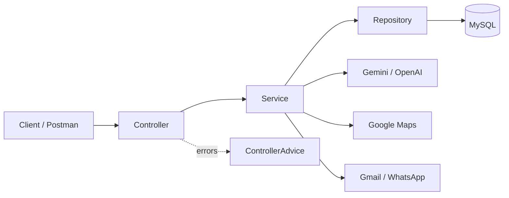
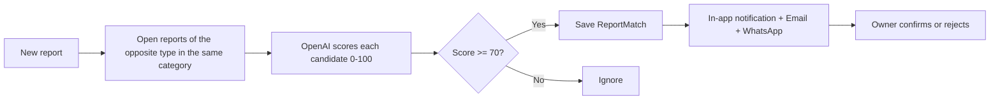
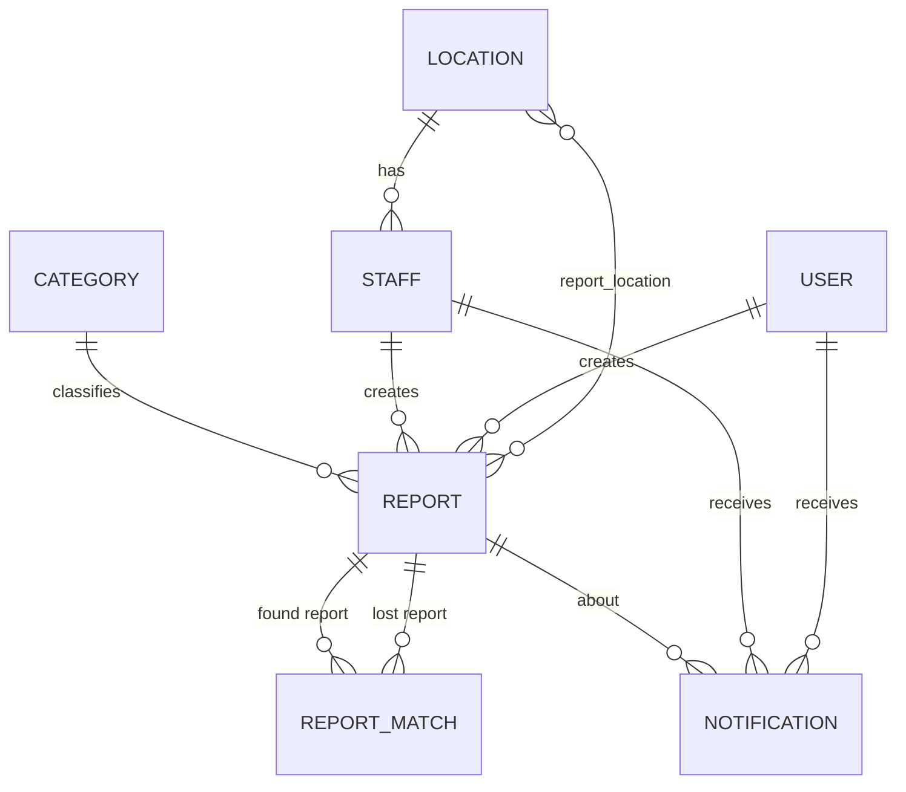

<div align="center">


# Ejad · إيجاد

**Smart lost-and-found platform powered by AI**

منصة ذكية تربط اللي فقدوا أغراضهم بالموظفين اللي لقوها


</div>

---

Ejad (إيجاد) is a lost-and-found platform that connects people who lost items with staff at public places (malls, airports, metro stations, universities) who found them. It starts in Riyadh and is built to expand across Saudi Arabia.

> Capstone 3 — Web Application Development by Java (Group Project)

## 📑 Table of Contents

- [Features](#-features)
- [Tech Stack](#️-tech-stack)
- [Integrations](#-integrations)
- [Architecture](#️-architecture)
- [How Matching Works](#-how-matching-works)
- [Data Model](#️-data-model)
- [Project Structure](#-project-structure)
- [Getting Started](#-getting-started)
- [Test Data](#-test-data)
- [API Overview](#-api-overview)
- [Team](#-team)
- [Extra Endpoints](#-extra-endpoints)

## ✨ Features

- **Lost & found reports**: users report lost items, and verified staff register items found at their location.
- **Image Analysis AI**: upload a photo and the AI fills in the item details (title, category, color, brand, description), or creates the whole report in one step.
- **Report Matching AI**: the AI compares lost and found reports and suggests matches with a similarity score and a reason. Matches scoring 70 or higher are saved automatically.
- **Admin Report AI**: the AI turns the platform's statistics into a written report for the admin.
- **Location services**: geocoding, reverse geocoding, nearby locations, nearby found items and Google Maps directions links.
- **Notifications**: users and staff are notified in-app, by email and on WhatsApp about new reports, suggested matches and confirmed matches.
- **Staff verification**: staff accounts must be verified by an admin before they become active.

## 🛠️ Tech Stack

| Layer | Technology |
|---|---|
| Language | Java 17+ |
| Framework | Spring Boot 3 (Spring Web, `RestClient`) |
| Persistence | Spring Data JPA, Hibernate |
| Database | MySQL |
| Validation | Jakarta Validation |
| Boilerplate | Lombok |
| Email | Spring Boot Mail |
| Async | Spring `@Async` for email and WhatsApp |
| Testing | Postman |
| Version control | Git & GitHub |

## 🔌 Integrations

| Service | Used for | How we integrated it |
|---|---|---|
|  **Google Gemini (Vision)** | Image Analysis AI | `AiService` sends the image as base64 with a prompt from `AiPrompts` to Gemini through a dedicated `RestClient` (`GeminiConfig`). The JSON response is mapped to `ImageAnalysisDTO` and the category name is converted to a category id. |
|  **Google Gemini (`google-genai` SDK)** | Admin Report AI | `AdminReportService` collects platform statistics and `GeminiService` generates the written report. |
|  **OpenAI (`gpt-4o-mini`)** | Report Matching AI | `AiService.compareReports` sends the new report and candidate reports to OpenAI (`AiConfig`). Each candidate gets a score from 0 to 100 and a reason in Arabic. |
|  **Google Maps Geocoding API** | Locations | `GoogleMapsService` converts place names to coordinates (limited to Saudi Arabia) and coordinates back to an address and city. |
|  **Google Maps URLs** | Directions | A free directions link is built for each location. |
| 📐 **Haversine formula** | Distances | Calculated locally with no API cost, used for nearby locations and nearby found reports. |
|  **UltraMsg (WhatsApp)** | Match alerts | `WhatsAppSender` sends a WhatsApp message to the owner of a lost report when a match is found. |
|  **Gmail SMTP** | Emails | `EmailSender` sends welcome emails, staff verification emails, report confirmations and match updates. |

Every external call is wrapped so that a failure in AI, email or WhatsApp never fails the main operation. For example, if OpenAI is down the report is still saved, just without matching.

## 🏗️ Architecture



## 🔄 How Matching Works



## 🗄️ Data Model

| Entity | Description |
|---|---|
| `BaseAccount` | Shared account fields, inherited by User, Staff and Admin |
| `User` | Person who reports a lost item |
| `Staff` | Employee at a location who registers found items |
| `Admin` | Manages the platform and verifies staff |
| `Location` | Place where items are lost or found (mall, airport, etc.) |
| `Category` | Item category (electronics, wallets, bags, etc.) |
| `Report` | A lost or found item report |
| `ReportMatch` | AI-suggested match between a lost report and a found report |
| `Notification` | Message sent to a user or staff member |



## 📁 Project Structure

```
com.example.ejadwebapplication
├── Advice       # Global exception handling
├── Api          # ApiException and ApiResponse
├── Client       # EmailSender, WhatsAppSender
├── Config       # AI, Gemini, Google Maps and UltraMsg configs, AiPrompts, DataSeeder
├── Controller   # REST endpoints
├── DTO          # AI and Google Maps response bodies
├── DTOIN        # Request bodies with validation
├── DTOOUT       # Response bodies
├── Enums        # LocationType, ReportType, ReportStatus, MatchStatus, NotificationType
├── Model        # JPA entities
├── Repository   # Database access
└── Service      # Business logic
```

## 🚀 Getting Started

1. Clone the repository:
   ```
   git clone https://github.com/gTurki/Ejad.git
   ```
2. Create a MySQL database and set the connection details in `src/main/resources/application.properties`.
3. Add the API keys to the configuration:
   ```properties
   openai.api.key=YOUR_OPENAI_KEY
   gemini.api.key=YOUR_GEMINI_KEY
   ai.model=YOUR_GEMINI_MODEL
   google.maps.api.key=YOUR_GOOGLE_MAPS_KEY
   ultramsg.instance.id=YOUR_INSTANCE_ID
   ultramsg.token=YOUR_ULTRAMSG_TOKEN
   spring.mail.username=YOUR_GMAIL
   spring.mail.password=YOUR_GMAIL_APP_PASSWORD
   ```
4. Run the application from your IDE, or with:
   ```
   ./mvnw spring-boot:run
   ```

On first run, the `DataSeeder` fills the database with sample data for testing.

## 🧪 Test Data

| Role | Username | Password | Notes |
|---|---|---|---|
| Admin | `admin` | `Admin1234` | |
| User | `sara` | `Sara1234` | |
| User | `fahad` | `Fahad1234` | |
| Staff | `khalid.staff` | `Khalid1234` | Verified, King Khalid Airport |
| Staff | `noura.staff` | `Noura1234` | Not verified, Al-Hamra mall |

The seeder also adds 7 categories and 4 locations in Riyadh. These accounts are for development only.

## 📊 API Overview

All endpoints start with `/api/v1`. Every resource supports `GET /get`, `GET /get/{id}`, `POST /add`, `PUT /update/{id}` and `DELETE /delete/{id}`, except `Notification` (no add/update, created by the system) and `ReportMatch` (no update, uses confirm/reject instead).

**102 endpoints in total: 37 CRUD + 65 extra.**

| Controller | Base Path | Total | CRUD | Extra |
|---|---|---|---|---|
| Report | `/report` | 24 | 5 | 19 |
| Notification | `/notification` | 16 | 3 | 13 |
| ReportMatch | `/match` | 13 | 4 | 9 |
| Location | `/location` | 12 | 5 | 7 |
| Admin | `/admin` | 11 | 5 | 6 |
| Staff | `/staff` | 9 | 5 | 4 |
| Category | `/category` | 7 | 5 | 2 |
| User | `/user` | 7 | 5 | 2 |
| AI | `/ai` | 2 | 0 | 2 |
| AdminReport | `/admin-report` | 1 | 0 | 1 |

## 👥 Team

<table>
  <tr>
    <td align="center" width="33%">
      <a href="https://github.com/AmiraAldajani"><br><b>Amira</b></a><br>
      <sub> Image Analysis AI</sub><br><br>
      Accounts (User, Staff, Admin), Locations, Google Maps, DataSeeder<br><br>
      <b>22</b> extra endpoints
    </td>
    <td align="center" width="33%">
      <a href="https://github.com/FAJR-ALI"><br><b>Fajr</b></a><br>
      <sub> Admin Report AI</sub><br><br>
      Reports, Categories, EmailSender, DataSeeder<br><br>
      <b>21</b> extra endpoints
    </td>
    <td align="center" width="33%">
      <a href="https://github.com/gTurki"><br><b>Turki</b></a><br>
      <sub> Report Matching AI</sub><br><br>
      ReportMatch, Notifications, AiService, WhatsAppSender<br><br>
      <b>22</b> extra endpoints
    </td>
  </tr>
</table>

## 🧩 Extra Endpoints

Paths are relative to `/api/v1`.  = powered by Gemini,  = powered by OpenAI.

<details open>
<summary> &nbsp;<b>Amira</b> — Accounts, Locations & Image Analysis AI (22)</summary>

| Method | Endpoint | Description |
|---|---|---|
| `POST` | `/ai/analyze-image` |  Analyze an item photo |
| `POST` | `/ai/analyze-and-report` |  Analyze a photo and create the report |
| `PUT` | `/admin/{adminId}/verify-staff/{staffId}` | Verify a staff account |
| `PUT` | `/admin/{adminId}/unverify-staff/{staffId}` | Remove a staff verification |
| `PUT` | `/admin/{adminId}/verify-all/{locationId}` | Verify all pending staff at a location |
| `GET` | `/admin/{adminId}/statistics` | Platform statistics for the admin |
| `GET` | `/admin/{adminId}/success-rate` | Percentage of lost reports that were resolved |
| `PUT` | `/admin/{adminId}/close-old-reports/{days}` | Close open reports older than X days |
| `GET` | `/user/{userId}/statistics` | A user's reports and matches summary |
| `GET` | `/user/search/{name}` | Search users by name |
| `GET` | `/staff/location/{locationId}` | Staff at a location |
| `GET` | `/staff/unverified` | Staff waiting for verification |
| `GET` | `/staff/verified` | Verified staff |
| `PUT` | `/staff/{staffId}/transfer/{locationId}` | Move staff to another location |
| `GET` | `/location/city/{city}` | Locations in a city |
| `GET` | `/location/type/{type}` | Locations by type |
| `GET` | `/location/statistics/{id}` | Staff and report counts for a location |
| `GET` | `/location/top` | Locations with the most reports |
| `PUT` | `/location/geocode/{id}` | Get coordinates from Google Maps |
| `GET` | `/location/nearby` | Locations within a radius |
| `GET` | `/location/reverse-geocode` | Address and city from coordinates |
| `GET` | `/report/nearby-found/{reportId}` | Found items near a lost report |

</details>

<details open>
<summary> &nbsp;<b>Fajr</b> — Reports, Categories & Admin Report AI (21)</summary>

| Method | Endpoint | Description |
|---|---|---|
| `GET` | `/admin-report` |  AI-generated admin report |
| `PUT` | `/report/close/{id}` | Close a report |
| `PUT` | `/report/reopen/{id}` | Reopen a closed report |
| `GET` | `/report/user/{userId}` | A user's reports |
| `GET` | `/report/user/{userId}/open` | A user's open reports |
| `GET` | `/report/staff/{staffId}` | A staff member's reports |
| `GET` | `/report/staff/{staffId}/location-open` | Open reports at the staff's location |
| `GET` | `/report/status/{status}` | Reports by status |
| `GET` | `/report/type/{type}` | Reports by type (lost / found) |
| `GET` | `/report/location/{locationId}` | Reports at a location |
| `GET` | `/report/category/{categoryId}` | Reports in a category |
| `GET` | `/report/city/{city}` | Reports in a city |
| `GET` | `/report/search/{keyword}` | Search reports by keyword |
| `GET` | `/report/color/{color}` | Reports by item color |
| `GET` | `/report/brand/{brand}` | Reports by item brand |
| `GET` | `/report/date-range/{from}/{to}` | Reports between two dates |
| `GET` | `/report/recent/{days}` | Reports from the last X days |
| `GET` | `/report/stale/{days}` | Open reports with no result for X days |
| `GET` | `/report/similar/{id}` | Similar reports without AI |
| `GET` | `/category/statistics` | Report count per category |
| `GET` | `/category/{categoryId}/report-count` | Report count for one category |

</details>

<details open>
<summary> &nbsp;<b>Turki</b> — Matching, Notifications & Report Matching AI (22)</summary>

| Method | Endpoint | Description |
|---|---|---|
| `PUT` | `/match/rematch/{reportId}` |  Run AI matching again for a report |
| `GET` | `/match/status/{status}` | Matches by status |
| `GET` | `/match/report/{reportId}` | Matches for a report |
| `GET` | `/match/report/{reportId}/suggested` | Pending suggestions, highest score first |
| `GET` | `/match/user/{userId}` | Matches for a user's reports |
| `GET` | `/match/staff/{staffId}` | Matches for items at the staff's location |
| `GET` | `/match/high-confidence/{minScore}` | Matches above a score |
| `PUT` | `/match/confirm/{id}` | Confirm a match |
| `PUT` | `/match/reject/{id}` | Reject a match |
| `GET` | `/notification/user/{userId}` | A user's notifications |
| `GET` | `/notification/user/{userId}/unread` | A user's unread notifications |
| `GET` | `/notification/user/{userId}/unread-count` | A user's unread count |
| `PUT` | `/notification/user/{userId}/read/{notificationId}` | Mark one as read |
| `PUT` | `/notification/user/{userId}/read-all` | Mark all as read |
| `DELETE` | `/notification/user/{userId}/delete-read` | Delete read notifications |
| `GET` | `/notification/user/{userId}/type/{type}` | A user's notifications by type |
| `GET` | `/notification/staff/{staffId}` | A staff member's notifications |
| `GET` | `/notification/staff/{staffId}/unread` | A staff member's unread notifications |
| `GET` | `/notification/staff/{staffId}/unread-count` | A staff member's unread count |
| `PUT` | `/notification/staff/{staffId}/read/{notificationId}` | Mark one as read |
| `PUT` | `/notification/staff/{staffId}/read-all` | Mark all as read |
| `DELETE` | `/notification/staff/{staffId}/delete-read` | Delete read notifications |

</details>
